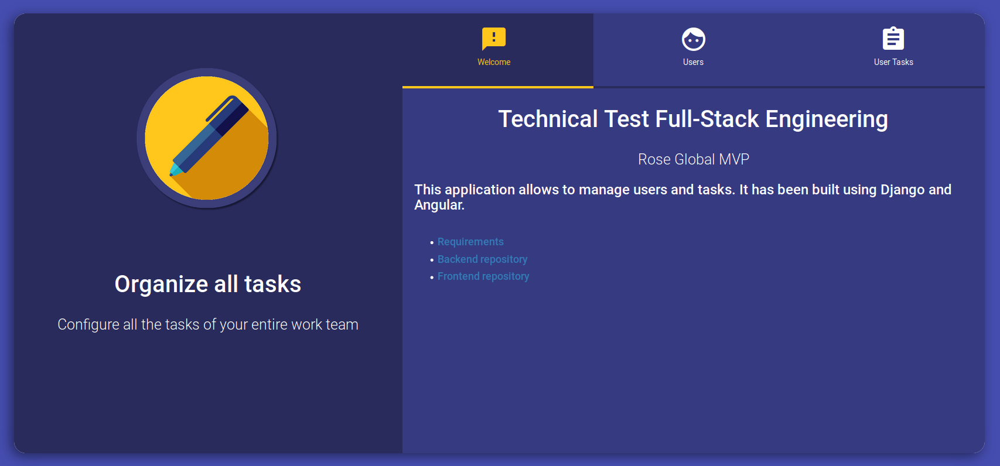
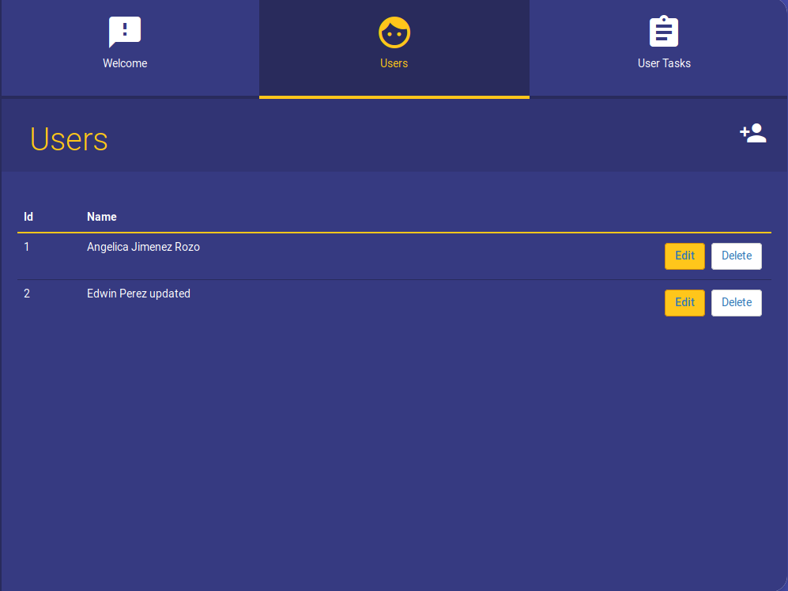
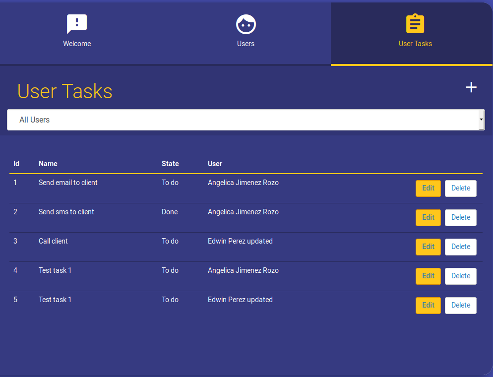

# Rose Global - Frontend
## Technical Test Full-Stack Engineering

At Rose Global we are creating a new MVP, this new platform must be scalable and flexible to support our continuous growth. We want to implement a micro-service architecture

This is the project for the requerid user interface.

### Requirements

* Node version 10.16.2
* Angular version 6.0.6

### Installation guide

1. Clone the project
2. Execute npm install to update dependencies
3. Execute ng serve to run the application
3. By default, the application will be available in http://localhost:4200

5. There are the two available tabs: Users and userTasks. Click any of those links to test crud interfaces: list, add, edit and delete.

### Roadmap

#### V 1.0
* User and userTask crud interfaces implemented
* Look and feel enchancements

#### V 1.1
* Unit tests

#### V 1.2
* Backend autentication integration

#### V 1.3
* Parametric model for task status integration
